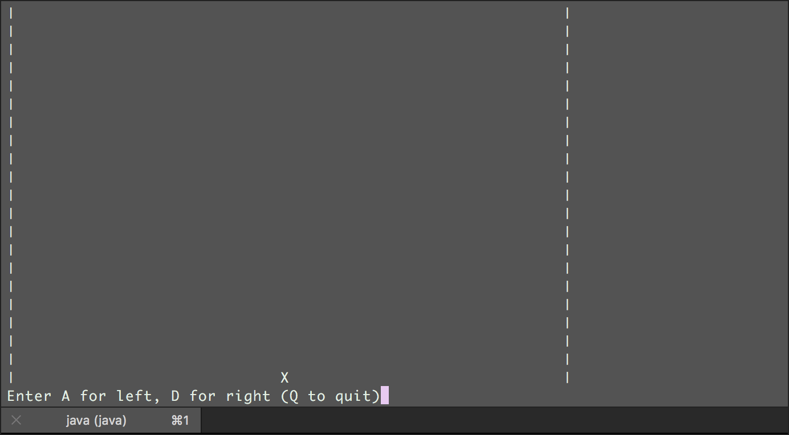

# spaceInvaders

Space Invaders Java version by Unlucky Team 13 :)

In V1, a blank board is printed with a character 'X' for the ship which the user can move left or right.
Current bugs: handling out of boundary array
