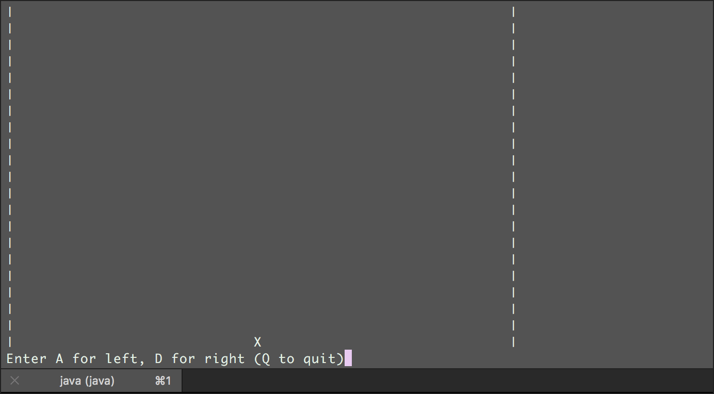
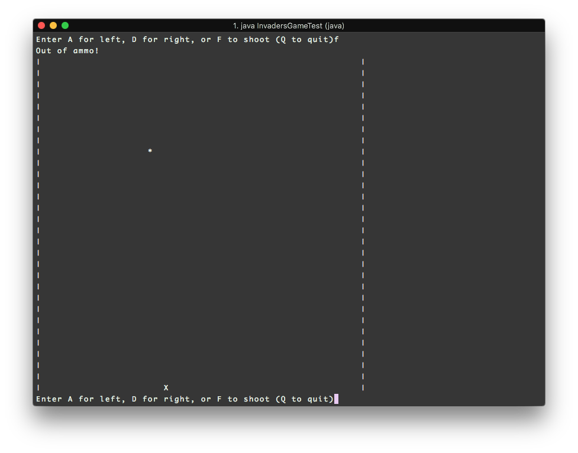
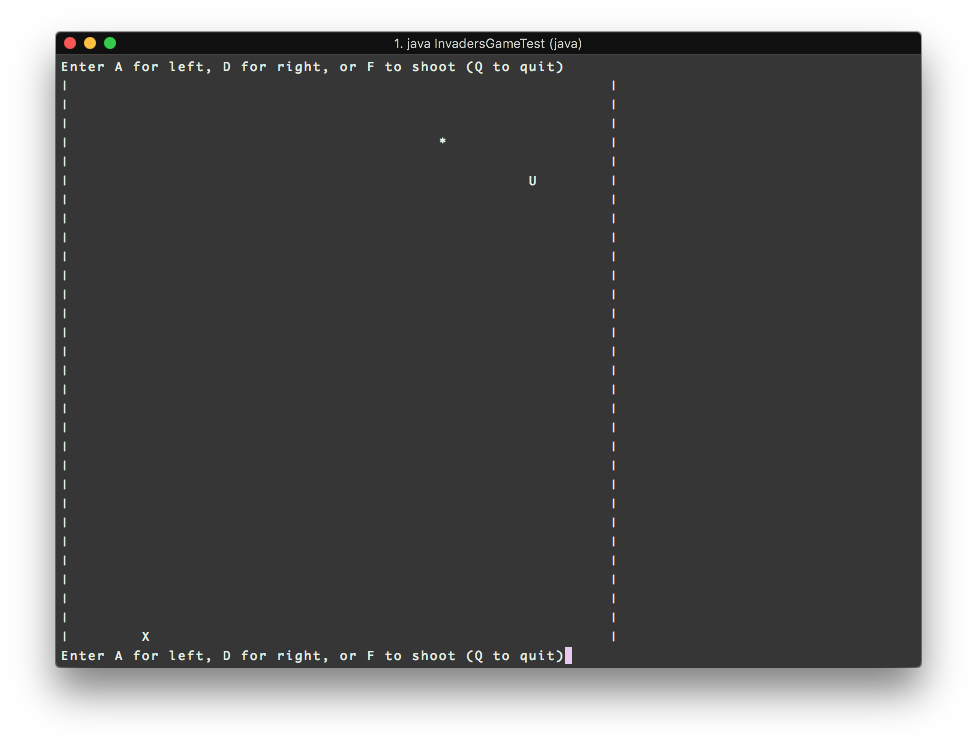

# spaceInvaders

Space Invaders Java version by Team Unlucky 13 :)

In 'V1', a blank board is printed with a character 'X' for the ship which the user can move left or right.
Current bugs: handling out of boundary array

In 'V2', shot '*' can be fired from the ships current column. Due to nature of Space Invaders, only one can be fired at a time. 

In 'V3', an alien 'U' travels the entire row then down one column and again travels row back, continuing so until a row limit is reached at which point game ends.
