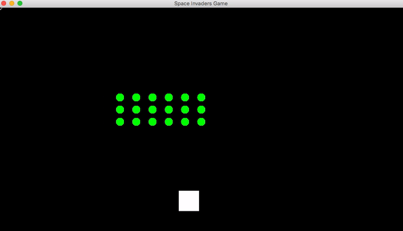

# spaceInvaders

Space Invaders Java version by Team Unlucky 13 :)

Previous output progress can be viewed in output folder. Most recent output is below:

In 'V5', array functionality is added where you can choose the rows and amount of aliens within each row, traversing down in a zigzag pattern. Current bugs: shot hitting two aliens at a time. 

In 'V6', Space Invaders is extended to a basic GUI version. 
