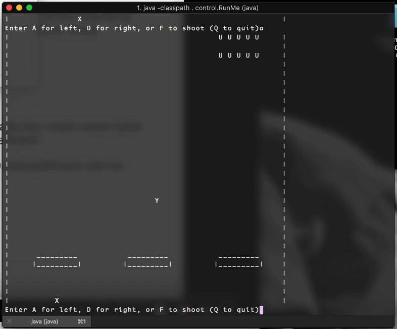
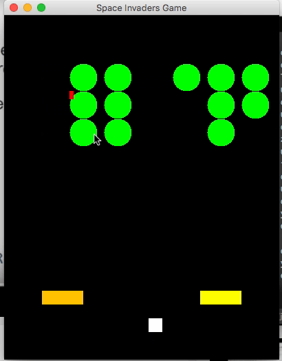

# spaceInvaders

Space Invaders Java version by Team Unlucky 13 :)

Authors:
Fytopoulou, Panagioa
Ma, Celina
Qureshi, Safian Omar
Virk, Simratdeep
Zurnaxhiu, Besim

I. File List
_________________________

Package: control
----------------

InvadersGameController.java
InvadersGameController$1.class
InvadersGameController.class

RunMe.java
RunMe$1.class
RunMe.class

Package: model
---------------

InvadersGameLogic.java                Drawable.java
InvadersGameLogic.class               Drawable.class

Alien.java                            AlienArray.java
Alien.class                           AlienArray.class

Barrier.java                          Shot.java
Barier.class                          Shot.class

PlayerShip.java                       Shape.java
PlayerShip.class                      Shape.class

Test Files: AlienTest.java
            AlienArrayTest.java
            PlayerShipTest.java
            ShotTest.java

	    hamcrest-core-1.3.jar
	    junit-4.12.jar

Package: view
---------------

InvadersGameGUI.java
InvadersGameGUI$1.class
InvadersGameGUI$Canvas.class
InvadersGameGUI.class

InvadersGameText.java
InvadersGameText.class

II.Design & Issues
_______________________
     
	 The game is designed to run both a text version in the Command Prompt, as well as a GUI version in a new window. Both versions are controlled by the InvadersGameController and the logic of the game is handled by InvadersGameLogic. Reducing code duplication and simplifying the code, inheritance is used in the Shape class which is extended over by Alien.java and PlayerShip.java as well as Shot.java (which is used for the player bullets and alien shots ).
	 When chosing the TEXT version of the game, the code is redirected to run InvadersGameText as well as print the game board and all its components.
	 When chosing the GUI version of the game, the code is redirected to run InvadersGameGUI, which implements the canvas and creates a new window to play the game in. Shape implements the class Drawable. 
	 
	 Issues that arose during the creation of the game from beginning to present are the alien array creation and hit detection. Alien array movement was complicated as many variables had to be taken into account and the program threw out of bounds errors as the alien array moved close to the border of the game board. Added functionality such as, when the outmost alien columns are destroyed, the entire array moves closer to the boundaries and is not just fixed, caused errors in the text version, but these were fixed. 
	Hit detection was one of the greatest issues as it had to take all the objects into account. For now we have split up the detection into Gui and text version as well as detection of different object collisions into separate methods.
        Errors which did not crash the game, such as Aliens not being drawn/printed in the space expected were fixed right away. 

Privacy Leaks
--------------
	This game relies on every class being able to access variables of the objects, privacy leaks in this case are inevitable, however constants such as boardHeight/Width and screenHeight/Width are immutable.

		
III. Imports
___________________
	
	import java.awt.Graphics;
	import java.awt.Color;
	import java.awt.Component;
	import java.util.Scanner;
	import javax.swing.Timer;
	import java.awt.event.KeyEvent;
	import java.awt.event.KeyListener;
	import java.awt.event.ActionListener;
	import java.awt.event.ActionEvent;
	import java.awt.Font;
	import java.awt.Dimension;
	import javax.swing.JComponent;
	import javax.swing.JFrame;
	
	
IV. Playing The Game
________________________

	Follow the instructions to play the game:
	
	1. In Command Prompt, run " RunMe ".
	2. Select the version, T for the Text version, G for the GUI version.
	3. Play the game, good luck!
	
	
	
--------------------------------------------
Fin	

Previous output progress can be viewed in output folder. Most recent output is below:

In 'V10', text version is brought up to functionality with aliens shooting down, barriers, improved hit detection and game ending conditions. 

In 'V11', alien shots can interact with/destroy barriers and functionality is nearly complete, with scoring and file i/o to be added.
