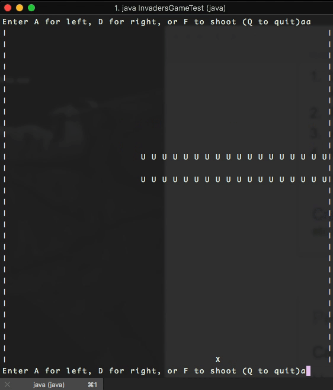
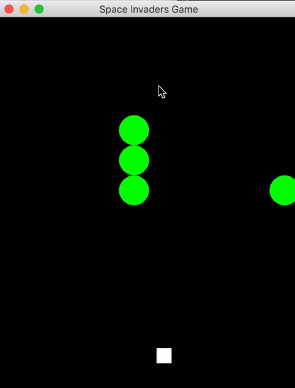

# spaceInvaders

Space Invaders Java version by Team Unlucky 13 :)

Previous output progress can be viewed in output folder. Most recent output is below:

In 'V5', array functionality is added where you can choose the rows and amount of aliens within each row, traversing down in a zigzag pattern. Current bugs: shot hitting two aliens at a time. 

In 'V7', a basic form of Space Invaders is nearly complete with a group of aliens traversing further down the screen with player able to move ship and fire shots, resulting in appropriate 'you win' or 'game over' screens. 
